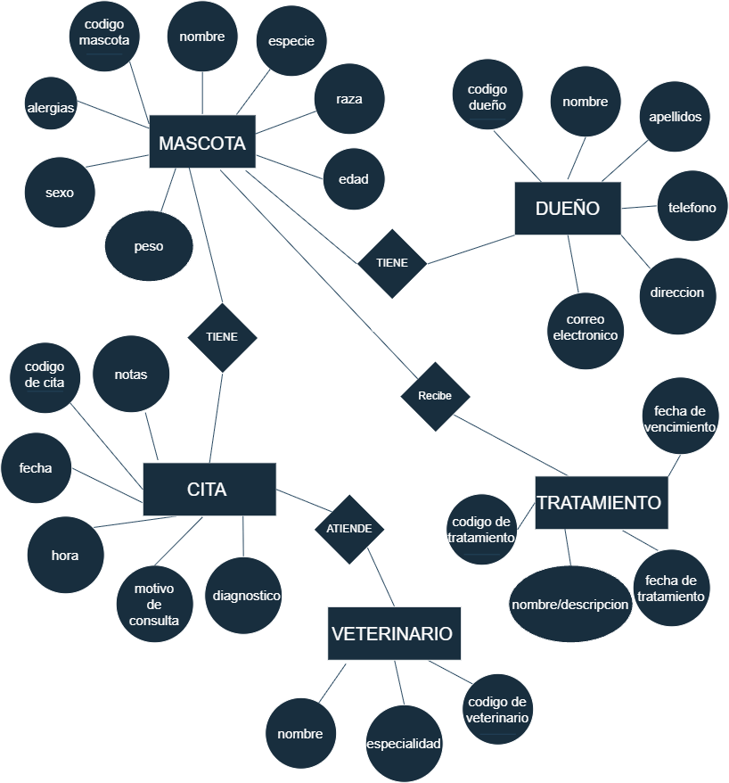

# Ejercicio 5. Caso de estudio y modelo entidad-relación
 
## 1. Identificación del problema
 
Una clínica veterinaria quiere llevar el control de sus pacientes (mascotas), dueños, citas y tratamientos. Al no tener un sistema establecido, 
esto genera problemas como: dificultad para encontrar el historial médico completo de una mascota, duplicidad de información de los dueños, pérdida 
de citas por falta de recordatorios, y dificultad para saber qué vacunas o tratamientos le corresponden a cada mascota y cuándo. Se necesita una base de 
datos que centralice la información de dueños, mascotas, veterinarios, citas y tratamientos, para agilizar la atención y llevar un historial confiable de
cada paciente.
 
## 2. Entrevista simulada con el cliente
 
**Pregunta:** ¿Qué información necesita registrar sobre cada mascota que atiende?
**Respuesta:** Necesito guardar el nombre de la mascota, especie, raza, edad, peso, sexo, y a qué dueño pertenece. También me gustaría llevar su historial 
médico: vacunas aplicadas, tratamientos anteriores y alergias, si tiene alguna.
 
**Pregunta:** ¿Qué datos se necesita de los dueños de las mascotas?
**Respuesta:** Nombre completo, teléfono, correo electrónico y dirección, para poder contactarlos en caso de recordatorios de citas o vacunas pendientes.
 
**Pregunta:** ¿Cómo maneja actualmente las citas? ¿Qué información debe quedar registrada de cada una?
**Respuesta esperada:** Necesito saber la fecha y hora de la cita, qué mascota va a ser atendida, qué veterinario la va a atender, el motivo de la consulta 
(revisión general, vacuna, cirugía, etc.) y el diagnóstico o notas que deje el veterinario después.
 
**Pregunta:** ¿Con qué frecuencia consulta esta información?
**Respuesta esperada:** Todos los días reviso la agenda de citas del día. El historial de cada mascota lo consulto cada vez que llega a consulta, 
para saber sus antecedentes antes de atenderla.
 
**Pregunta:** ¿Qué reportes le gustaría poder generar?
**Respuesta esperada:** Me gustaría poder ver un listado de las mascotas que tienen vacunas próximas a vencer, un reporte de cuántas citas atendió 
cada veterinario en un periodo, y un historial completo de consultas por mascota o por dueño.
 
**Pregunta:** ¿Un veterinario puede tener horarios o especialidades específicas que debamos registrar?
**Respuesta esperada:** Sí, algunos veterinarios se especializan en cirugía, otros en dermatología, y sería bueno saber en qué días trabaja cada uno.
 
**Pregunta:** ¿Qué pasa si una mascota necesita varias citas?
**Respuesta esperada:** Me gustaría poder ver todas las citas relacionadas a una misma mascota, no solo como citas sueltas.

## 3. Lista de Requerimientos de Datos y Funciones

### Requerimientos de Datos
* **Datos del Dueño:** Código identificador único (`codigo dueño`), nombre, apellidos, teléfono, correo electrónico y dirección completa.
* **Datos de la Mascota:** Identificador único (`codigo mascota`), nombre, especie, raza, edad, peso, sexo y alergias conocidas.
* **Datos del Veterinario:** Identificador único (`codigo de veterinario`), nombre y especialidad clínica.
* **Datos de la Cita:** Folio único (`codigo de cita`), fecha, hora, motivo de consulta, diagnóstico y notas médicas.
* **Datos del Tratamiento:** Identificador único (`codigo de tratamiento`), nombre/descripción, fecha de tratamiento y fecha de vencimiento (o próxima dosis).

### Requerimientos Funcionales
* **Gestión de clientes y pacientes:** Registrar a los dueños y asociar sus mascotas sin duplicar datos de contacto.
* **Control de agenda médica:** Programar citas asociando de forma obligatoria a la mascota atendida con el veterinario responsable.
* **Historial clínico integrado:** Consultar el historial cronológico de citas, notas y diagnósticos de cualquier paciente.
* **Seguimiento de tratamientos y vacunas:** Registrar los medicamentos y vacunas aplicados a cada mascota, monitoreando su vigencia mediante la fecha de vencimiento.
* **Reportes operativos:** Generar listados de citas atendidas por veterinario en un periodo determinado y reportes de vacunas próximas a vencer.

---

## 4. Diagrama Entidad-Relación

A continuación se presenta el modelado conceptual bajo la notación Entidad-Relación de Chen:

---

## 5. Justificación del Modelo

* **Entidad DUEÑO:** Representa al cliente legalmente responsable de las mascotas. Centralizar sus datos previene inconsistencias y redundancia de datos personales cada vez que registra un nuevo animal.
* **Entidad MASCOTA:** Modela al paciente clínico, registrando sus características biológicas y médicas (`alergias`, `peso`, `sexo`) para su atención personalizada.
* **Entidad VETERINARIO:** Administra al personal médico y su `especialidad`, asegurando asignar la consulta al especialista correspondiente (ej. dermatología, cirugía).
* **Entidad CITA:** Representa el evento de atención médica. Permite almacenar la fecha, hora, diagnóstico y observaciones de cada consulta.
* **Entidad TRATAMIENTO:** Permite registrar los fármacos y vacunas administrados, gestionando la caducidad y fechas de refuerzo con el atributo `fecha de vencimiento`.
* **Relación DUEÑO - MASCOTA (TIENE):** Cardinalidad **1:N**. Un dueño puede tener varias mascotas registradas, pero cada mascota pertenece a un único dueño.
* **Relación MASCOTA - CITA (TIENE):** Cardinalidad **1:N**. Una mascota puede tener múltiples citas a lo largo de su expediente, pero cada cita corresponde a una única mascota.
* **Relación VETERINARIO - CITA (ATIENDE):** Cardinalidad **1:N**. Un veterinario atiende múltiples consultas en su turno, pero cada cita es atendida por un médico responsable.
* **Relación MASCOTA - TRATAMIENTO (Recibe):** Cardinalidad **1:N**. A una mascota se le pueden administrar múltiples tratamientos y vacunas durante su vida médica.
* **Resolución de la problemática:** Este diseño centraliza la información, elimina la duplicidad de dueños, garantiza la consulta rápida del historial clínico completo y hace posible alertar sobre esquemas de vacunación por vencer.