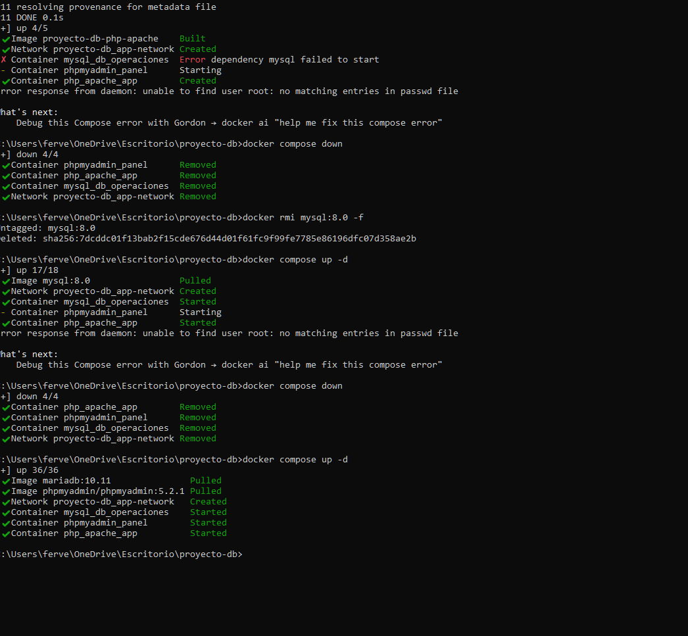
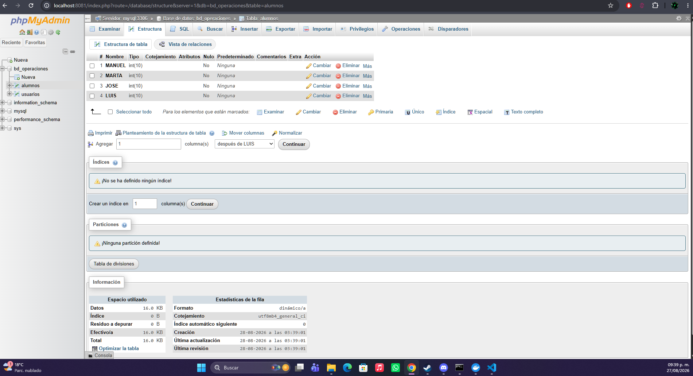

# Ejercicio 2. El sistema gestor en un contenedor: Docker
 
## Parte A. Investigación
 
### 1. Qué es un contenedor y en qué se diferencia de una máquina virtual
 
Un **contenedor** es una unidad de software que empaqueta una aplicación junto con todo lo que necesita para ejecutarse (bibliotecas, 
dependencias y archivos de configuración), de modo que se pueda correr de forma consistente en cualquier entorno. A diferencia de una
máquina virtual, el contenedor **no incluye un sistema operativo completo**: comparte el kernel del sistema operativo anfitrión y solo 
aísla los procesos y recursos que necesita.
 
Las diferencias principales frente a una **máquina virtual (VM)** son:
 
- **Arranque:** un contenedor inicia en segundos (a veces en milisegundos), porque solo levanta un proceso sobre el sistema operativo ya
  existente. Una máquina virtual tarda minutos, ya que debe arrancar un sistema operativo completo desde cero, igual que una computadora física.
- **Tamaño:** un contenedor suele pesar decenas o cientos de megabytes, pues solo contiene la aplicación y sus dependencias. Una máquina
   virtual pesa varios gigabytes, porque incluye un sistema operativo completo además de la aplicación.
- **Aislamiento:** la máquina virtual ofrece un aislamiento más fuerte, ya que cada una tiene su propio kernel y sistema operativo,
  virtualizando el hardware completo mediante un hipervisor. El contenedor ofrece un aislamiento más ligero a nivel de procesos: los contenedores
  están separados entre sí, pero comparten el mismo kernel del anfitrión, lo que los hace más eficientes pero con una barrera de seguridad menos rígida.
### 2. Definiciones
 
- **Imagen:** es una plantilla de solo lectura que contiene todo lo necesario para crear un contenedor: el sistema de archivos, la aplicación,
  sus dependencias y la configuración de arranque. Es como un "molde" a partir del cual se generan los contenedores. Por ejemplo, la imagen oficial
  `postgres:16` contiene PostgreSQL ya instalado y listo para usarse.
- **Contenedor:** es una instancia en ejecución de una imagen. Mientras la imagen es estática (solo lectura), el contenedor es la versión "viva"
  que corre, con su propia capa de escritura temporal. De una misma imagen se pueden crear muchos contenedores independientes.
- **Volumen:** es un mecanismo de almacenamiento persistente gestionado por Docker, que vive fuera del ciclo de vida del contenedor.
  Permite que los datos sobrevivan aunque el contenedor se detenga, se elimine o se reemplace por uno nuevo.
- **Puerto publicado:** es la asignación que conecta un puerto interno del contenedor con un puerto del equipo anfitrión, permitiendo el acceso
  desde el exterior. Por ejemplo, al publicar `5432:5432`, se puede conectar a PostgreSQL desde pgAdmin en la máquina local, aunque el servidor esté
  corriendo dentro del contenedor.
  
### 3. Por qué el volumen es indispensable y qué ocurre si no se declara
 
El volumen es indispensable porque los contenedores son **efímeros por diseño**: toda la información escrita dentro de la capa de escritura de 
un contenedor existe únicamente mientras ese contenedor exista. En el caso de una base de datos, esto es crítico, ya que los datos son precisamente 
lo que debe conservarse a largo plazo.
 
Si **no se declara un volumen**, ocurre lo siguiente: mientras el contenedor esté corriendo o simplemente detenido (`docker stop`), los datos siguen ahí 
y se recuperan al reiniciarlo. Sin embargo, en el momento en que el contenedor se **elimina** (`docker rm`), se recrea, o se actualiza a una nueva versión 
de la imagen, **todos los datos almacenados se pierden de forma definitiva**, sin posibilidad de recuperación. Esto incluye las tablas creadas, los registros 
insertados y cualquier configuración hecha dentro de la base de datos.
 
Al declarar un volumen, en cambio, los datos se guardan fuera del contenedor (en un directorio gestionado por Docker en el sistema anfitrión), por lo que 
se pueden eliminar, recrear o actualizar contenedores libremente sin perder la información. Esto es justamente lo que permite, por ejemplo, actualizar 
PostgreSQL de una versión a otra conservando toda la base de datos intacta.

---

## *Referencias*

Docker Inc. (s.f.). Volumes. Docker Docs. https://docs.docker.com/engine/storage/volumes/

Docker Inc. (s.f.). Persisting container data. Docker Docs. https://docs.docker.com/get-started/docker-concepts/running-containers/persisting-container-data/

Docker Inc. (s.f.). Persist the DB. Docker Docs. https://docs.docker.com/guides/workshop/05_persisting_data/

## Parte B. Evidencias de Ejecución Práctica

## Garcia Verduzco Fernando

### Orquestación de Contenedores con Docker Compose
Se orquestó un entorno multi-contenedor compuesto por el motor relacional MariaDB, el panel de administración phpMyAdmin y el servidor de aplicación Apache/PHP bajo la red virtual `app-network`:

### Validación de Persistencia e Interacción Web
Se ingresó a phpMyAdmin (`localhost`), comprobando la conexión con el motor, la creación de la base de datos `bd_operaciones` y la persistencia de los registros en la tabla:

---

